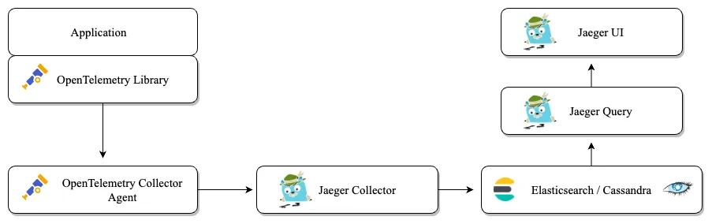

```sh
goose -dir database/migrations create init_schema sql
```

### Telemetry

1. __Application (OTel library):__ This is your application code that has been instrumented with the OpenTelemetry libraries.
2. __OpenTelemetry Collector:__ The collected telemetry data from the application is sent to the OpenTelemetry Collector. This component can receive data from various application instances and forwards it to analytical tools like jaeger
3. __jaeger-collector:__ The Jaeger Collector receives trace data from the OTel Collector. It’s responsible for processing the data, such as validating, transforming, and storing it.
4. __Elasticsearch/Cassandra:__ The processed data is stored in a database or in-memory storage. This could be a datastore like Cassandra or Elasticsearch where Jaeger keeps its trace information.
5. __jaeger-query:__ This component retrieves trace data from the storage when requested and serves it to the user interface.
6. __jaeger-UI:__ This is the graphical user interface of Jaeger where users can visualize and query the trace data

#### Example for using tracing by open-telemetry in handle API:
```go 
var tracer = otel.Tracer("github.com/Salaton/tracing/pkg/usecases/product")


func (u UseCaseImplementation) CreateProduct(ctx context.Context, product Product) (Product, error) {
 ctx, span := tracer.Start(ctx, "CreateProduct")
 defer span.End()
 return u.store.CreateProduct(ctx, product)
}
```